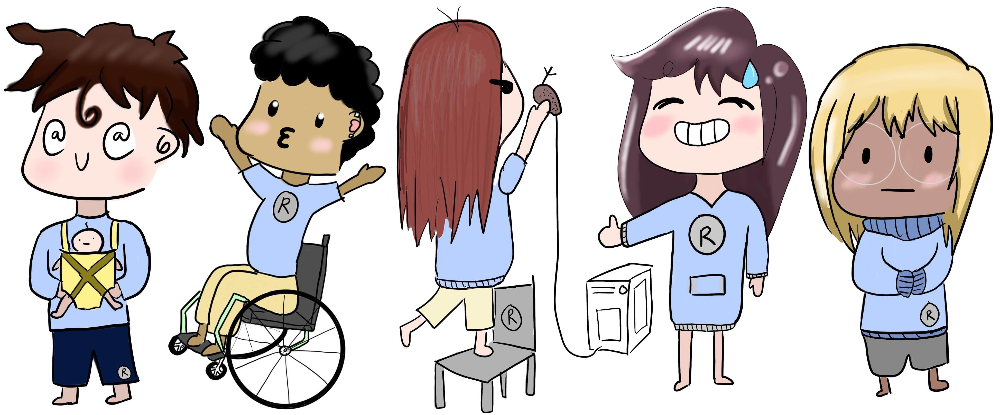
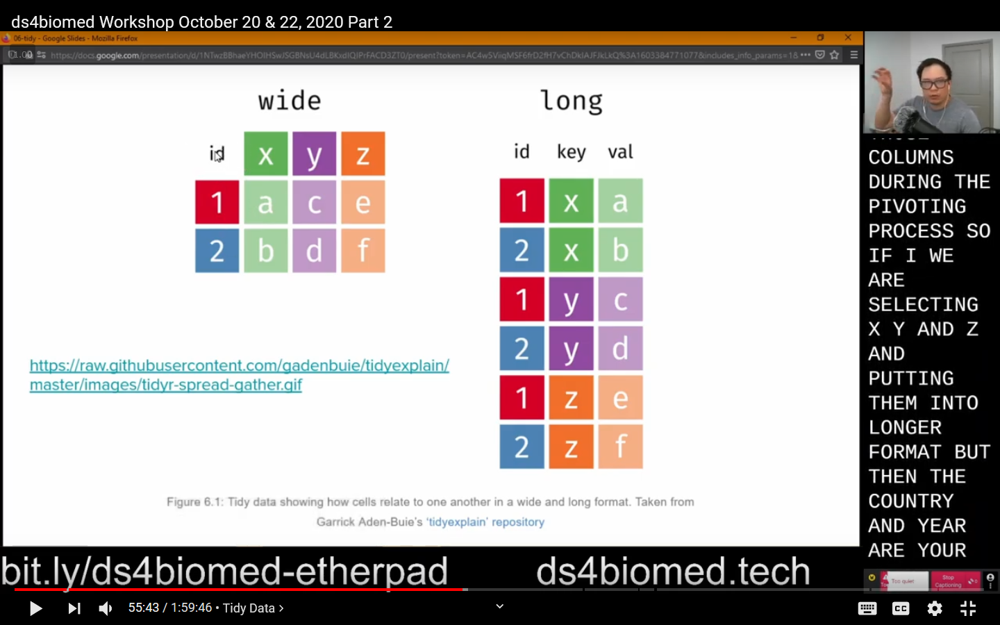

```{r, eval=FALSE, include=FALSE}
# run and build the slides using the command below
# https://github.com/yihui/xaringan/issues/29
xaringan::inf_mr(cast_from = "../..")

# print to pdf
pagedown::chrome_print("2020-11-17-committee_meeting/2020-11-17-committee_meeting.html", format = "pdf")
```


<style>
* {
  box-sizing: border-box;
}

/* Create four equal columns that floats next to each other */
.column4 {
  float: left;
  width: 25%;
  padding: 10px;
  height: 300px; /* Should be removed. Only for demonstration */
}

/* Clear floats after the columns */
.row4:after {
  content: "";
  display: table;
  clear: both;
}

div.smaller {
font-size:90%;
}
</style>

```{r setup, include=FALSE}
library(knitr)
library(fs)
library(here)
```

# Me

.pull-left[
```{r, echo=FALSE}
knitr::include_graphics("../figs/people/daniel_chen_square.jpg")
```
- Ph.D, Virginia Tech, 2021, GBCB
- MPH, Columbia, 2014, Epidemiology
]
.pull-right[
- The Carpentries
  - Instructor, 2014
  - Maintainer, 2016 - 2018
  - Instructor Trainer, 2020
  - Maintainer Lead, 2020


  .pull-left[
- Pearson
  - Book
  - Python + Git classes
  ]
  .pull-right[
  .center[
  
  ]
  ]

- RStudio Intern 2019
  - RStudio Education team
  - `gradethis` package
]

???

Career in data science + education in the health sciences
---

# The committee

<div class="row4">

  <div class="column4" style="background-color:#fffff;">
    <h2>Anne Brown</h2>
    
    <p>Library</p>
    <p>Committee Chair</p>
    <p><a href="https://bevanbrownlab.com">BBL</a> + <a href="https://www.databridge.dev/">DB</a></p>
  </div>

  <div class="column4" style="background-color:#fffff;">
    <h2>Dave Higdon</h2>
    
    <p>Statistics</p>
    <p>Department Head</p>
  </div>

  <div class="column4" style="background-color:#fffff;">
    <h2>Alex Hanlon</h2>
    
    <p>Statistics</p>
    <p><a href="https://biostat.centers.vt.edu/">CBHDS</a></p>
    <p><a href="https://biostat.centers.vt.edu/">iTHRIV BERD</a></p>
  </div>

  <div class="column4" style="background-color:#fffff;">
    <h2>Nikki Lewis</h2>
    
    <p>Honors College</p>
    <p>Computational Research Grant</p>
  </div>

</div>

???

BBL = Bevan Brown Lab
DB = Data Bridge

CBHDS = Center of Biostatistics and Health Data Science
BERD = Biostatistics, Epidemiology and Research Design (BERD) Core

---

class: inverse, middle, center

# Background

---

# Data Science Education in the Biomedical Sciences

- "Integrating scientific programming in communities of practice for students in life science"
    - https://dl.acm.org/doi/10.1145/3332186.3333040
- People in the life sciences are afraid to take courses in CS and Stats

## Goal

- Create an inviting learning environment
- Start from scratch
  - Positive comment from a learner in post-workshop survey

???

ds education in general has room for growth
---

# Dreyfus model of skill acquisition

- Novice
- Competent
- Expert

## This isn't new...

- Creating learner personas to focus materials and learning objectives
- Motivating examples with formative assessments
- Surveying learners
- Curriculum is full
  - Figuring out what to take out
      - Plotting and logistic regression

---

# Already existing learning materials


## But...
- General purpose, not domain focused
  - Plays a big role in motivation and building mental models

---

# Build a community

## At VT

- Help augment the training from Center for Biostatistics and Health Data Science (CBHDS)
    - https://biostat.centers.vt.edu/
- Goal is not to teach statistics but the data literacy side of data science
    - Managing and "cleaning" data
    - Be able to better communicate with analysts and statisticians
- Symbiotic relationship
  - Data Services and Data Bridge at the Library
  - The VT Carpentries community
  - CBHDS

## In general

- R/Medicine community
- Biomedical informatics

---

# Sustanining a commmunity of practice

- Open educational materials
- Resources and people to help
- Influx and efflux of people

## In-person and online

- [The Carpentries Resources for Online Workshops](https://docs.carpentries.org/topic_folders/hosts_instructors/resources_for_online_workshops.html)
  - [Workshop Logistics and Screen Layouts](https://carpentries.org/blog/2020/06/online-workshop-logistics-and_screen-layouts/)
- [Using OBS for Online Teaching](https://daniel.rbind.io/2020/10/27/using-obs-for-online-teaching/)

---


class: inverse, middle, center

# Overall Dissertation Overview

---

# Phases + research questions

### IRB

- **IRB 20-537**: Data Science Workshops for Biomedical and Health Professionals: Persona Identification and Workshop Assessment

### 3 Phases (i.e., 3 papers + chapters)

Survey based (Adapted from [The Carpentries](https://carpentries.org/assessment/)):

1. Pre-workshop student **self-assessment** survey
  - create learner personas
2. **Pre/post workshop** survey
  - assess the workshop materials
  - assess learning objectives
3. **Long-term workshop** survey (6 months out)
  - see if the materials helped with fundamental knowledge to learn more on their own
  - longitudinal study

---

# (Community) Deliverables

In addition to the 3 papers + chapters:

1. Identify and create learner personas for the biomedical community
2. Create a set of CC-0 lessons for the biomedical community
  - Carpentries-inspired
  - Carpenties Incubator: Data Science for Practicing Clinicians
      - https://carpentries-incubator.github.io/Data-Science-for-Docs/
      - Too much emphasis on Medical Doctors
---

# Current progress

1. IRB approved study: IRB 20-537 (Summer 2020)
2. Conducted the pre-workshop learner self-assessment (Summer 2020)
3. Created 4 learner personas (Fall 2020)
4. Created workshop content and learning materials (Fall 2020)
5. Conducted first iteration of workshops (October 20 and 22, 2020)
6. 2 x 1-day 4-hour workshops scheduled in December (8 + 9, 2020)

## Planning for
7. More workshops in 2021
  - On the order of once per month
  - Current + new materials
8. Prelims in Feburary 2021

---

# D1. Identify and create learner personas for the biomedical community

.center[

]

.pull-left[
[4 Personas](https://ds4biomed.tech/who-is-this-book-for.html):
- Alex Academic
- Clare Clinician
- Patricia Programmer
- Samir Student
]
.pull-right[
Persona contains:
1. Background
2. Relevant prior knowledge or experience
3. Perception of needs
4. Special considerations
]

---

# Creating Personas
  - Personas of teachers in a classroom

.pull-left[
- Paper: "Through the Eyes of Faculty: Using Personas as a Tool for Learner-Centered Professional Development"
- Methods that combine hierarchical agglomerative cluster analysis with chi-square values or squared Euclidian distance values and complete or average linkage

]
.pull-right[
```{r, echo=FALSE}

```

Figure 1: Dendrogram used for persona creation.
]

https://www.lifescied.org/doi/10.1187/cbe.19-06-0114

---

# Example personas

.center[
```{r, echo=FALSE}

```
]


Figure 2: Summaries of personas.

---

# RStudio learner Personas

Extended the RStudio personas to also include Data knowledge

```{r, echo=FALSE}

```

https://rstudio-education.github.io/learner-personas/

---

# D2. Create a set of CC-0 lessons for the biomedical community

.pull-left[
.center[

]
]
.pull-right[
- Book + workshop materials: https://ds4biomed.tech/
- Slides + papers: <a href="bit.ly/ds4biomed-gdrive">bit.ly/ds4biomed-gdrive</a>


]

---

# Learning Objectives

Using Bloom's taxonomy:

1. Name the features of a tidy/clean dataset
2. Transform data for analysis
3. Identify when spreadsheets are useful
4. Assess when a task should not be done in a spreadsheet software
5. Break down data processing into smaller individual (and more manageable) steps
6. Construct a plot and table for exploratory data analysis
7. Build a data processing pipeline that can be used in multiple programs
8. Calculate, interpret, and communicate an appropriate statistical analysis of the data

---

# Workshops (i.e., Dissertation Data)

- October 20 + 22, 2020: Pilot workshop over VT listservs
  - Day 1: 20 participants
  - Day 2: 11 participants
- December 8, 2020: Roanoke
- December 9, 2020: Business for Healthcare (Lynchburg)


.pull-left[

]
.pull-right[
1. Online + in-person learning
  - [Online Workshop Logistics and Screen Layouts](https://carpentries.org/blog/2020/06/online-workshop-logistics-and_screen-layouts/)
2. Live captions
  - [Using OBS for Online Teaching](https://daniel.rbind.io/2020/10/27/using-obs-for-online-teaching/)
]

YouTube Playlist: https://www.youtube.com/watch?v=nQ4lbmKD1no&list=PL4eF1KHNgDfK9rDZLrKc5K2wtQqtJEAnS

---

class: inverse, middle, center

# Phase 1 / Chapter 1: Persona creation

---

# Listservs

1. iTHRIV (Taryn Luoma, MHA)
2. GBCB
3. IGEP (Dennie Munson)
4. VetMed (Andrea Green)
5. MPH (Hannah Menefee, MPH)
6. VT Carpentries workshops (Nathaniel Porter, PhD)
7. VT Roanoke Center (David Conners)

No explicit email sent to the for VCOM listserve

Sample population does **not** contain 8 iTHRIV Scholars

---

# Overall results

```{r, echo=FALSE}
knitr::include_graphics("../../dissertation-analysis/output/survey/01-self_assessment/likert.png")
```

Raw data is important, but do not recognize why programming is important.
---

# Hierarchical clustering

- Centered + Scaled ordinal survey questions
- Euclidean distance
- Ward's Clustering

```{r, echo=FALSE}
knitr::include_graphics("../../dissertation-analysis/output/persona/dendogram_4.png")
```

---

# Optimal Clusters

The elbow plot and gap statistic suggests the optimal number of clusters is from 2-4.

.pull-left[

```{r, echo=FALSE, fig.height=2}
knitr::include_graphics("../../dissertation-analysis/output/persona/elbow_plot.png")
```
]
.pull-right[

```{r, echo=FALSE}
knitr::include_graphics("../../dissertation-analysis/output/persona/gap_statistic.png")
```
]

---

# 4 Clusters (i.e., personas) for interprebility

.pull-left[

```{r, echo=FALSE}
knitr::include_graphics("../../dissertation-analysis/output/persona/dendogram_2.png")
```

```{r, echo=FALSE}
knitr::include_graphics("../../dissertation-analysis/output/persona/dendogram_3.png")
```
]

.pull-right[
```{r, echo=FALSE}
knitr::include_graphics("../../dissertation-analysis/output/persona/dendogram_4.png")
```

- 2: Experts, Non-Experts
- 3: Experts, Clinicians, Academics
- 4: Experts, Clinicians, Academics (Students, Academics + researchers)
]

---

# 4 Learner Personas

.center[

]

.pull-left[
4 Personas:
- Alex Academic
- Clare Clinician
- Patricia Programmer
- Samir Student
]
.pull-right[
Persona contains:
1. Background
2. Relevant prior knowledge or experience
3. Perception of needs
4. Special considerations
]

https://ds4biomed.tech/who-is-this-book-for.html

---

class: smaller

# Overall results by group

```{r, echo=FALSE, out.width="120%"}
knitr::include_graphics("../../dissertation-analysis/output/persona/group_descriptives_4/likert_prop.png")
```

(1) Alex Academic, (2) Samir Student, (3) Patricia Programmer, (4) Clare Clinician

???

orange = "student" group 2 (dendogram blue)
green  = "academic" group 1 (dendogram cyan)
purple = "expert" group 3 (dendogram red)
pink = "clinicians" group 4 (dendogram green)
---

# PCA

Survey questions were mostly paired, and the PCA results confirm this

```{r, echo=FALSE}
original_width <- getOption("width")
options(width = 70)

pca_persona_scaled <- readRDS("../../dissertation-analysis/output/persona/pca_results.RDS")
print(summary(pca_persona_scaled))

options(width = original_width)
```
---

class: smaller

# EFA

Picked the highest loaded question in each factor

.pull-left[
2 Factors
```{r, echo=FALSE}
efa2 <- readRDS("../../dissertation-analysis/data/final/persona/efa2-promax.RDS")
efa2$loadings
```
]
.pull-right[
3 Factors
```{r, echo=FALSE}
efa3 <- readRDS("../../dissertation-analysis/data/final/persona/efa3-promax.RDS")
efa3$loadings
```
]

---

# EFA Results

- 3 factors with promax rotation.
  - Each factor coincided with a survey question blocks

- Programming:
  - Q3.3: How familiar are you with interactive programming languages like Python or R?
- Stats:
  - Q6.2: If you were given a dateset containing an individual's smoking status (binary variable) and whether or not they have hypertension (binary variable), would you know how to conduct a statistical analysis to see if smoking has an increased relative risk or odds of hypertension? Any type of model will suffice.
- Data:
  - Q4.4: Do you know what "long" and "wide" data are?

---

class: smaller

# CART

.pull-left[
6.2: Logistic regression
  1. "I wouldn't know where to start",
  2. "I could struggle through, but not confident I could do it",
  3. "I could struggle through by trial and error with a lot of web searches",
  4. "I could do it quickly with little or no use of external help"

3.3: Python/R
  1. "I do not know what those are",
  2. "I have heard of them but have never used them before",
  3. "I have installed it, but have only done simple examples with them",
  4. "I have written a small program with them before",
  5. "I use it to automate certain repetitive tasks",
  6. "I have small side projects that I program in it",
  7. "I program in them for work"

4.4: Long and wide
  1. "I have never heard of the term",
  2. "I have heard of it but don't remember what it is.",
  3. "I have some idea of what it is, but am not too clear",
  4. "I know what it is and could explain what it pertains to"
]
.pull-right[
```{r, echo=FALSE}
knitr::include_graphics("../../dissertation-analysis/output/persona/cart.png")
```
]

---

class: inverse, middle, center

# Phase 2: Workshop results

---

# October 20 + 22, 2020 (T/R)

- 27 People signed up

- 2 Sessions
  - Day 1 12:30 - 15:00 (2.5 Hours)
      - 20 attended
      - Spread sheets, loading data, grouped descriptive statistics
  - Day 2 12:30 - 14:30 (2.0 Hours)
      - 11 attended
      - Tidy data
      - Plotting + logistic regression was blown through

Recordings on YouTube
(Bevan & Brown Lab
[ds4biomed workshop playlist](https://www.youtube.com/watch?v=nQ4lbmKD1no&list=PL4eF1KHNgDfK9rDZLrKc5K2wtQqtJEAnS))

---

class: inverse, middle, center

# Phase 2a: Pre-workshop results

---

# Pre-workshop survey

- n = 8 (7/20 completed survey)

```{r, echo=FALSE}
knitr::include_graphics("../../dissertation-analysis/output/survey/02-pre_workshop/Q2.4.png")
```

---

# Pre-workshop survey: Occupation

```{r, echo=FALSE}
knitr::include_graphics("../../dissertation-analysis/output/survey/02-pre_workshop/Q2.5.png")
```

---

# Pre-workshop survey: Self-identification

```{r, echo=FALSE}
knitr::include_graphics("../../dissertation-analysis/output/survey/02-pre_workshop/Q3.1.png")
```

---

# Pre-workshop survey: Self-assessment

```{r, echo=FALSE}
knitr::include_graphics("../../dissertation-analysis/output/survey/02-pre_workshop/likert-self_assessment.png")
```

---

# Pre-workshop survey: Learning objectives

```{r, echo=FALSE}
knitr::include_graphics("../../dissertation-analysis/output/survey/02-pre_workshop/likert-learning_objectives.png")
```

---

class: inverse, middle, center

# Phase 2b: Post-Workshop results

---

# Post-workshop: Summative assessment

```{r, echo=FALSE}
knitr::include_graphics("../../dissertation-analysis/output/survey/03-post_workshop/likert-summative_assessment.png")
```

Nobody selected "I wouldn't know where to start"

---

# Post-workshop: Environment

```{r, echo=FALSE}
knitr::include_graphics("../../dissertation-analysis/output/survey/03-post_workshop/likert-environment.png")
```

No negative comments about workshop environment

---

class: smaller

# Pre/Post-workshop: Self-assessment

.pull-left[
Pre-workshop
```{r, echo=FALSE}
knitr::include_graphics("../../dissertation-analysis/output/survey/02-pre_workshop/likert-self_assessment.png")
```
]
.pull-right[
Post-workshop
```{r, echo=FALSE}
knitr::include_graphics("../../dissertation-analysis/output/survey/03-post_workshop/likert-self_assessment.png")
```
]

.pull-left[
Delta plot
```{r, echo=FALSE}
knitr::include_graphics("../../dissertation-analysis/output/survey/03-post_workshop/diff-likert-self_assessment.png")
```
]
.pull-right[
1. ...programming project, if I got stuck, I can find ways of overcoming the problem
2. Using a programming language ... can make my analyses easier to reproduce
3. Using a programming language ... can make me more efficient at working with data
4. I know how to search for answers to my technical questions online
5. I can write a small program, script, or macro ...
6. ... having access to the original, raw data is important...
7. ... confident in my ability to make use of programming software to work with data
]

---

# Pre/Post-workshop: Self-assessment delta

```{r, echo=FALSE}
knitr::include_graphics("../../dissertation-analysis/output/survey/03-post_workshop/diff-likert-self_assessment.png")
```

---

class: smaller

# Pre/Post-workshop: Learning objectives

.pull-left[
Pre-workshop
```{r, echo=FALSE}
knitr::include_graphics("../../dissertation-analysis/output/survey/02-pre_workshop/likert-learning_objectives.png")
```
]
.pull-right[
Post-workshop
```{r, echo=FALSE}
knitr::include_graphics("../../dissertation-analysis/output/survey/03-post_workshop/likert-learning_objectives.png")
```
]

.pull-left[
Delta plot
```{r, echo=FALSE}
knitr::include_graphics("../../dissertation-analysis/output/survey/03-post_workshop/diff-likert-learning_objectives.png")
```
]
.pull-right[
1. Transform data for analysis
2. Name the feature of a tidy/clean dataset
3. Identify when spreadsheets are useful
4. Construct a plot and table for exploratory data analysis
5. Calculate, interpret, and communicate an appropriate statistical analysis of the data
6. Build a data processing pipeline that can b e used in multiple programs
7. Break down data processing into smaller individual (and more manageable) steps
8. Assess when a task should not be done in a spreadsheet software
]

---

# Learning objectives not met

- Construct a plot and table for exploratory data analysis
- Calculate, interpret, and communicate an appropriate statistical analysis of the data

```{r, echo=FALSE}
knitr::include_graphics("../../dissertation-analysis/output/survey/03-post_workshop/diff-likert-learning_objectives.png")
```

---
class: inverse, middle, center

# Phase 3: April 2021

---

class: inverse, middle, center

# Prelims: Feburary 2021

---

class: center, middle

# Thanks!

https://github.com/chendaniely/dissertation-presentations
